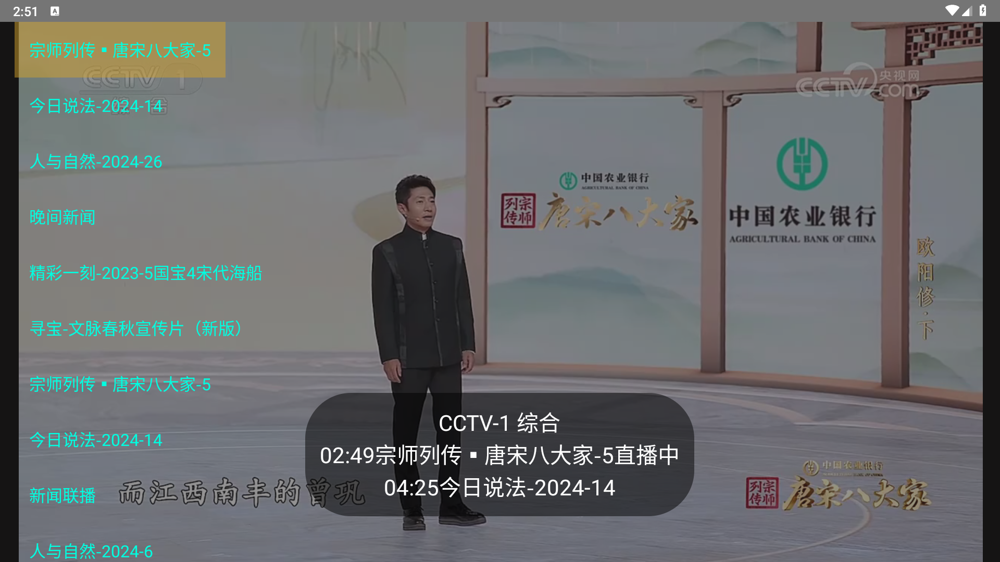

  
  <h1 align="center">央视浏览器</h1>  
一个电视机顶盒及Android TV收看中国中央电视台直播的浏览器 

## 下载安装包
https://github.com/Zcodeoooo/CCTV_Viewer/releases/

已更新功能
    
    今日节目单切换,直播进度后退前进,安卓webview全屏适配,硬件加速

## 目前可看频道 
CCTV-1 综合
 
CCTV-2 财经
 
CCTV-3 综艺
 
CCTV-4 中文国际
 
CCTV-5 体育
 
CCTV-6 电影
 
CCTV-7 国防军事
 
CCTV-8 电视剧
 
CCTV-9 纪录
 
CCTV-10 科教
 
CCTV-11 戏曲
 
CCTV-12 社会与法
 
CCTV-13 新闻
 
CCTV-14 少儿
 
CCTV-15 音乐
 
CCTV-16 奥林匹克
 
CCTV-17 农业农村
 
CCTV-5+ 体育赛事

CCTV-4 中文国际（欧）

CCTV-4 中文国际（美）
